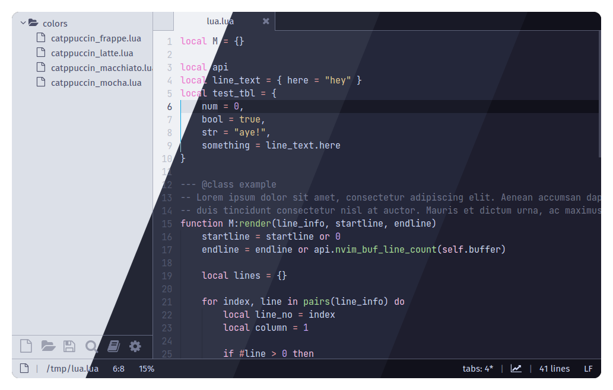

<h3 align="center">
	<br/>
	
	Catppuccin for Lite-xl
	
</h3>

<p align="center">
    <a href="https://github.com/catppuccin/template/stargazers"></a>
    <a href="https://github.com/catppuccin/template/issues"></a>
    <a href="https://github.com/catppuccin/template/contributors"></a>
</p>

<p align="center">
  
</p>

## Previews

<details>
<summary>🌻 Latte</summary>
  
</details>
<details>
<summary>🪴 Frappé</summary>
  
</details>
<details>
<summary>🌺 Macchiato</summary>
  
</details>
<details>
<summary>🌿 Mocha</summary>
  
</details>

## Usage

1. Clone this repository
2. open the cloned directory
3. copy the desired theme from the `colors` directory to `~/.config/lite-xl/colors/`
4. in `~/.config/lite-xl/init.lua` add this line and replace `flavour` with either `latte`, `frappe`, `macchiato` or `mocha`
  + ```core.reload_module("colors.catppuccin_flavour")```


## 💝 Thanks to

- [Saimoomedits](https://github.com/saimoomedits)
- [Redlolz](https://github.com/redlolz)

&nbsp;

<p align="center"></p>
<p align="center">Copyright &copy; 2021-present <a href="https://github.com/catppuccin" target="_blank">Catppuccin Org</a>
<p align="center"><a href="https://github.com/catppuccin/catppuccin/blob/main/LICENSE"></a></p>
